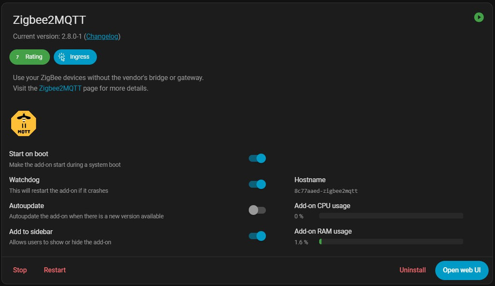
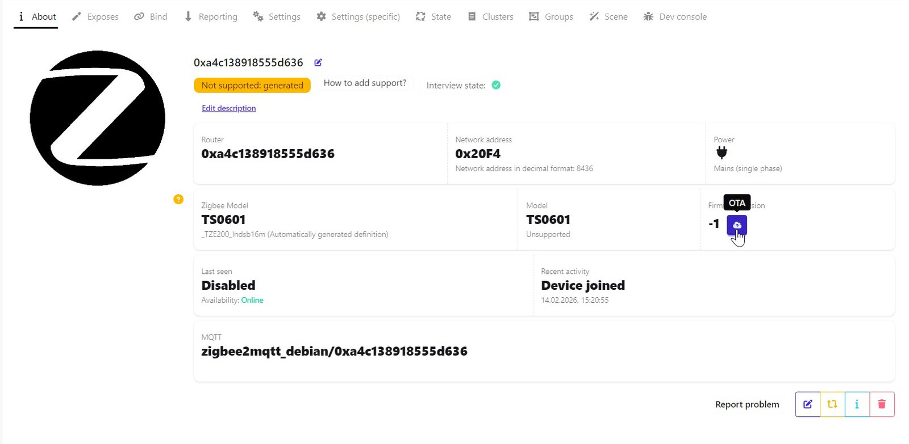
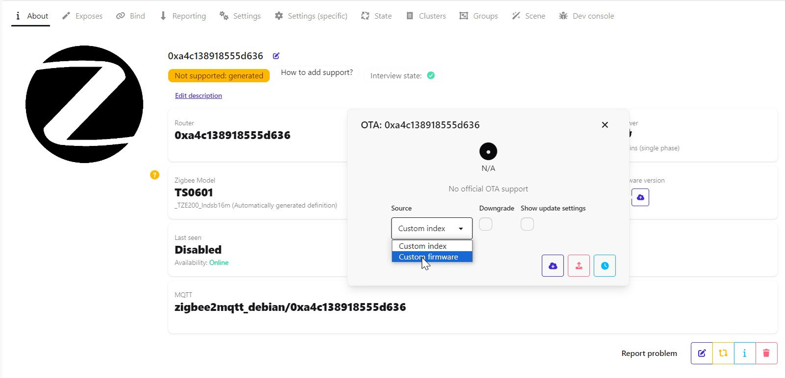
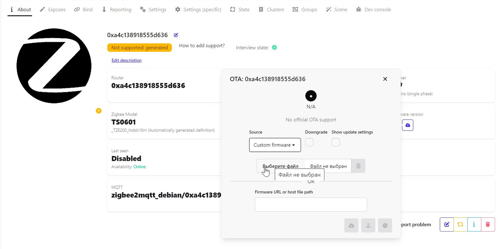
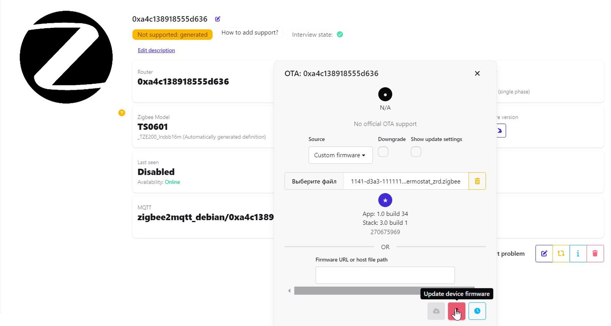
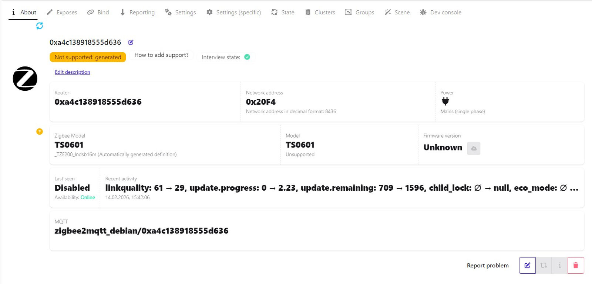
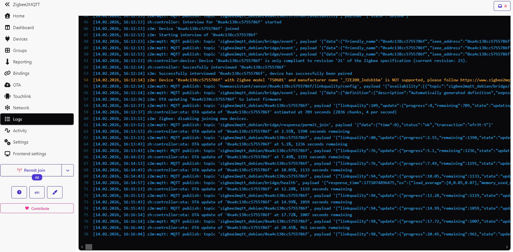

# <a id="Top">Tuya Thermostat for Floor Heating Zigbee with custom firmware</a>

### [Описание на русском](README_rus.md)

### Custom firmware for Tuya thermostat models

     

    

<!--
| Custom Zigbee Model | Original Zigbee Manufacturer | Description       |
|:-------------------:|:----------------------------:|:-----------------:|
| Tuya_Thermostat_r01 | _TZE204_u9bfwha0             | [:bookmark_tabs:] |
| Tuya_Thermostat_r02 | _TZE200_edl8pz1k             | [:bookmark_tabs:] |
-->

| Custom Zigbee Model | Original Zigbee Manufacturer | Description |
|:-------------------:|:----------------------------:|:-----------:|
| Tuya_Thermostat_r01 | `_TZE204_u9bfwha0` `_TZE204_aoclfnxz` | [:bookmark_tabs:](doc/thermostats/tuya_thermostat_r01/README.md) |
| Tuya_Thermostat_r02 | `_TZE200_edl8pz1k` `_TZE204_edl8pz1k` | [:bookmark_tabs:](doc/thermostats/tuya_thermostat_r02/README.md) |
| Tuya_Thermostat_r03 | `_TZE204_tagezcph` | [:bookmark_tabs:](doc/thermostats/tuya_thermostat_r03/README.md) |
| Tuya_Thermostat_r04 | `_TZE204_xyugziqv` | [:bookmark_tabs:](doc/thermostats/tuya_thermostat_r04/README.md) |
| Tuya_Thermostat_r05 | `_TZE204_5toc8efa` | [:bookmark_tabs:](doc/thermostats/tuya_thermostat_r05/README.md) |
| Tuya_Thermostat_r06 | `_TZE204_lzriup1j` `_TZE204_oh8y8pv8` `_TZE204_gops3slb` `_TZE284_cvub6xbb`| [:bookmark_tabs:](doc/thermostats/tuya_thermostat_r06/README.md) |
| Tuya_Thermostat_r07 | `_TZE204_mpbki2zm` | [:bookmark_tabs:](doc/thermostats/tuya_thermostat_r07/README.md) |
| Tuya_Thermostat_r08 | `_TZE204_7rghpoxo` `_TZE200_7rghpoxo` `_TZE200_lndsb16m` | [:bookmark_tabs:](doc/thermostats/tuya_thermostat_r08/README.md) |
| Tuya_Thermostat_r09 | `_TZE204_6a4vxfnv` | [:bookmark_tabs:](doc/thermostats/tuya_thermostat_r09/README.md) |
| Tuya_Thermostat_r0A | `_TZE284_xalsoe3m` `_TZE204_xalsoe3m` | [:bookmark_tabs:](doc/thermostats/tuya_thermostat_r0a/README.md) |
| Tuya_Thermostat_r0B | `_TZE204_8byfmxdv` | [:bookmark_tabs:](doc/thermostats/tuya_thermostat_r0b/README.md) |
| Tuya_Thermostat_r0C | `_TZE204_szbxmorb` | [:bookmark_tabs:](doc/thermostats/tuya_thermostat_r0c/README.md) |

**The author assumes no responsibility if you turn your smart thermostat into a half-witted thermostat by using this project.**

Only the thermostats listed above were checked. If you have a different signature,  it is better not to flash without checking for a datapoint match.

**Theoretically, the firmware can be adapted for any thermostat with an IEEE beginning with**

**`A4 C1 38`**


**If the IEEE start is different from the specified one, then the thermostat has a different chip in the Zigbee module, you can't use this project.**

Only tested in `zigbee2mqtt`. As of the April 2025 version of `zigbee2mqtt`, no external converter is needed. Support is enabled globally.

## Why. 

To keep it from spamming the network. The first instance (see above) sent 25 packets every 8 seconds.

## Result. 

**About**


**Exposes**


**Reporting**


## How to update.

With the release of the new version, `zigbee2mqtt` updating has become much easier.



You just need to switch to the new interface - `zigbee2mqtt-windfront`.

So, let's download it from the repository <a id="custom_ota_fw">[Update file](https://github.com/slacky1965/tuya_thermostat_zrd/raw/refs/heads/main/bin/1141-d3a3-1111114b-tuya_thermostat_zrd.zigbee)</a>. Go to the device. And on the right, you'll see `Firmware versiona` cloud icon. This is where we'll go.



Next, select `Custom firmware` from the list that opens.



After this, select the file you downloaded earlier (see [above](#custom_ota_fw)).



And click update.



To see if the update has started, look at the thermostat icon  a rotating circle with arrows should appear. In `Recent activity` the remaining time in seconds and the download percentage will be displayed.



And all this will be recorded in the log.



After the update is complete, the first time you launch the custom firmware, it copies `bootloader` and clears the memory area where the device's network address is stored. Therefore, after the update, simply allow pairing, `zigbee2mqtt` and the thermostat will automatically connect to the network. All that remains is to forcefully uninstall the old version of the thermostat.

That's it, the thermostat is ready to go.

> [!WARNING]
> Attention!!! If in the process you find a new updateon other Tuya devices that you may still have in your system, you do not need to update anything!!! Otherwise you will flash into this device firmware from the thermostat and get a brick!!! If the update process has already started by mistake, just turn off the device!!!


This is what the log looks like on the first startup after upgrading from Tuya to custom firmware.

```
OTA mode enabled. MCU boot from address: 0x8000
Firmware version: v1.0.22
Tuya signature found: "lndsb16m"
Use modelId: Tuya_Thermostat_r08
Sent announcement
```

---

In Home Assistant, it looks like this


## How to write a new firmware version into an already updated thermostat.

All updates will be available via z2m as new releases are released; you don't need to do anything specifically for this.

That's it!

P.S. Not tested in real work, requires extensive testing.

A more detailed description of the very first thermostat [here](https://habr.com/ru/articles/864740)

---

You can contact me at **[Telegram](https://t.me/slacky1965)**.

### If you would like to thank the author, you can do so via [YouMoney](https://yoomoney.ru/to/4100118300223495).

---

Thanks :))))

- [@ruslikx3m](https://t.me/ruslikx3m) for the first provided thermostat `_TZE204_u9bfwha0` to tear apart.

- [@immortal_serg](https://t.me/immortal_serg) for providing the thermostat `_TZE204_edl8pz1k`.

- [@chernyshevruslan](https://t.me/chernyshevruslan) for providing the thermostats `_TZE204_tagezcph` in two different versions and `_TZE204_xyugziqv`.

- [@Alleol](https://t.me/Alleol) for providing the thermostat `_TZE204_lzriup1j`.

- [@terekhins](https://t.me/terekhins) for providing the `_TZE204_aoclfnxz` thermostat made by `MOES`.

- [@shadow_by](https://t.me/shadow_by) for providing the `_TZE204_aoclfnxz` thermostat made by `MOES`.

- [@dbunevich](https://t.me/dbunevich) for providing the thermostat `_TZE204_mpbki2zm`.

- [@liberatemei](https://t.me/liberatemei) for providing the thermostat `_TZE204_oh8y8pv8`.

- [@rheinx](https://t.me/rheinx) for providing the thermostat `_TZE204_6a4vxfnv`

- [@Nobodevi4](https://t.me/Nobodevi4) for providing the thermostat `_TZE284_cvub6xbb`

- [https://github.com/doctor64](https://github.com/doctor64) [@doctor_64](https://t.me/doctor_64) - for always wanting to help and point me in the right direction.

- [https://github.com/devbis](https://github.com/devbis) [@Belokobylskiy](https://t.me/Belokobylskiy) - for ideas and writing scripts in Python and for the z2m converter.

- [@goofyk](https://t.me/goofyk) - for patience and for knowing z2m well.

- [https://github.com/pvvx](https://github.com/pvvx) - for a wonderful programmer for Telink chips.

## Version History
- 1.0.01
	- Initial version.
- 1.0.02
	- Release. Removed due to an issue with the OTA update.
- 1.0.03
	- Fixed an issue with being able to set the heating temperature above the threshold set in maxHeatSetpoint. 
	- Corrected the converter for thermostat wiring in Home Assistant. 
	- Added callback functions of remote commands to DataPoints structure. 
	- Tested thermostat with signature `_TZE204_aoclfnxz`. Fixed problem with OTA update.
- 1.0.03a
	- PreRelease.
- 1.0.04
	- Added a thermostat with the signature `_TZE204_edl8pz1k`. 
	- Added callback functions of local commands to DataPoints structure.
	- Added `watchdog`.
	- The formation of zb_modelId has been changed. 
		> When upgrading to custom firmware, thermostats with different signatures, but which are essentially the same device, will now receive the same group name, regardless of signature.
	- Changed z2m covetors, now it's just two files. 
		> One for the thermostat with original firmware, one for the thermostat with custom firmware. There is no need to change anything in them.
- 1.0.05
	- Added thermostat with signature `_TZE204_tagezcph`
		> Checked two thermostats, one with the rotary knob down the middle, the other down the right side.
	- Edited the internal variable names associated with the model number.
		> It used to count from 0. Now it counts from 1. It's just for convenience, so that you don't get confused. For example, it used to be type0, now it is type1, etc.
	- Converters have been updated.
- 1.0.06
	- Added thermostat with signature `_TZE204_xyugziqv`
	- Increased uart buffer to 512 bytes. The last thermostat sends a lot of packets at one time.
	- Converters updated
- 1.0.07
	- Fixed a problem with the number of running timers. In z2m everything worked, but in ZHA it was overloading.
- 1.0.08
	- Updated SDK to version [V3.7.1.2](https://github.com/telink-semi/telink_zigbee_sdk/releases/tag/V3.7.1.2)
	- Updated `local_ota_index.js` - explicitly specifies devices to be updated.
	- The upgrade instructions have been changed - at the end you do not need to uninstall the device, just go through the interview and configuration procedures again.
- 1.0.09
	- Fixed a bug with saving settings and then restoring them when power is applied.
	- Added `watchdog` clearing to uart operation. This situation could happen - ZTU MCU was rebooted when MCU did not answer for a long time.
	- Converters for `zigbee2mqtt` 2.0.0 version have been updated
	- Updated instructions.
- 1.0.10
	- Added thermostat with signature `_TZE204_5toc8efa` from BSEED (GL86HTEZ1B).
	- The converters and the local update download file have been updated.
	- Updated instructions.
- 1.0.11
	- Added thermostat with signature `_TZE204_lzriup1j` manufactured by Avatto (ZWT10016A).
	- Added autodetection of `UART` speed. According to [Tuya Zigbee Serial protocol](https://developer.tuya.com/en/docs/mcu-standard-protocol/mcusdk-zigbee-uart-protocol?id=Kdg17v4544p37) standard, the speed can be `9600` or `115200`.
	- Added to the converter for z2m to display the schedule already available in the thermostat.
	- The converters and the local update download file have been updated.
	- Updated instructions.
- 1.0.12
	- A thermostat with signature `_TZE204_aoclfnxz` manufactured by `MOES` was physically tested. Based on the results, the code for processing incoming and outgoing packets in ` uart` was modified.
	- The `_TZE200_edl8pz1k` signature was added to the converters.
	- Added `System Mode` parameter to the data saved and restored at startup. When resetting the module, this parameter was set to 0, which was perceived by remote systems as if the thermostat was turned off.
- 1.0.13
	- Added thermostat with signature `_TZE204_mpbki2zm`.
- 1.0.14
	- Added a thermostat with the signature `_TZE204_7rghpoxo`.
	- Converters have been updated.
- 1.0.15
	- The outgoing packet queue has been changed. It is now an adapted ring buffer.
	- Enabled chip supply voltage check to eliminate errors when writing to flash memory when the voltage is less than 2.2 volts. Relevant in case of power failure.
	- Added timeouts for outgoing packets.
	- Reduced the number of outgoing identical responses for thermostats `_TZE204_edl8pz1k` and `_TZE204_aoclfnxz`, otherwise the program was often overloaded by watchdog.
	- The code for checking and overwriting `bootloader` has been removed from the main firmware - it was a potential threat of boot sector corruption under certain circumstances. This code is now only contained in the firmware that is loaded on the first update.
	- At the first update, the version number will always be `1.0.00` - done specially for the fastest update to the main firmware, where there is no code to check and overwrite `bootloader`.
	- Added a thermostat with the signature `_TZE200_7rghpoxo`. I have not checked it, added based on the words of a user who checked it.
	- Converters have been updated.
- 1.0.16
	- Added a thermostat with the signature `_TZE204_oh8y8pv8`.
- 1.0.17
	- Added thermostat with signature `_TZE204_gops3slb` (not tested, see [issue](https://github.com/slacky1965/tuya_thermostat_zrd/issues/124)).
	- Added thermostat with signature `_TZE204_6a4vxfnv`.
	- Fixed SDK bug with reporting.
- 1.0.18
	- Added thermostat with signature `_TZE284_cvub6xbb`.
- 1.0.19
	- Added thermostat with signature `_TZE284_xalsoe3m`.
	- Added thermostat with signature `_TZE204_8byfmxdv`.
	- Modified `Factory Reset` procedure.
	- Added the ability to change the thermostat's `ZigBee model` via the `mqtt` topic.
- 1.0.20
	- Added thermostat with signature `_TZE204_szbxmorb`.
	- Fixed a bug with the schedule divider.
- 1.0.21
	- Fixed error of enabling programming mode for Model r07 `_TZE204_mpbki2zm`.
- 1.0.22
	- The bootloader replacement procedure has been changed. Now, updating from the original firmware to the custom one is a single operation.
	- Added thermostat with signature `_TZE200_lndsb16m`
	
[Top](#Top)


