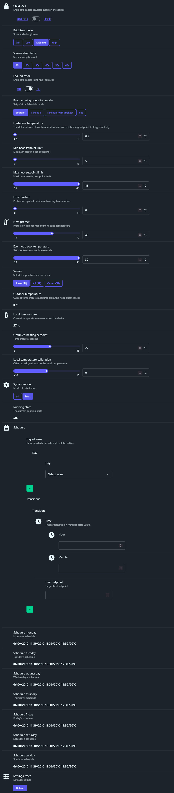

## Краткое описание термостата с сигнатурой

	"_TZE204_lpedvtvr"
	
### Внешний вид.

### Настройки, доступные удаленно.

### Расписание.

Расписание имеет 7 вхождений по 4 периода.

	1. Понельник.
	2. Вторник.
	3. Среда.
	4. Четверг.
	5. Пятница.
	6. Суббота.
	7. Воскресенье.

Один период - часы, минуты и температура включения.
